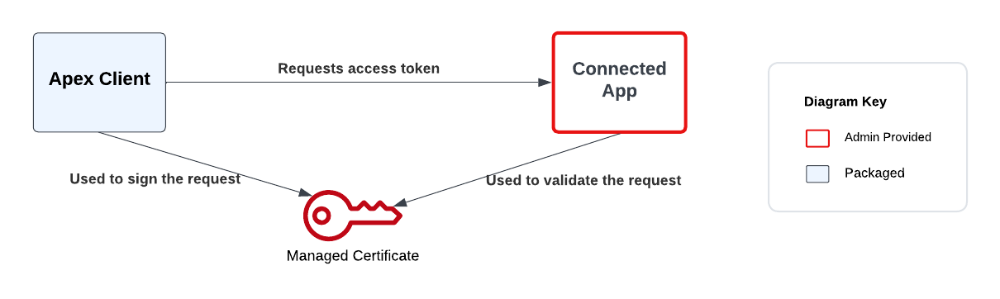
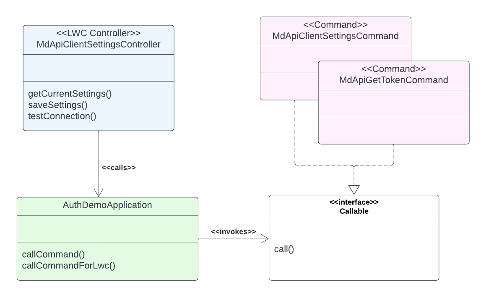

# JWT Bearer Token Connected App Sample Code

This project contains sample code to allow Metadata API calls using the JWT Bearer Flow using an Admin Provided Connected App.

The code consists of an Apex application and sample Lightning page. The sample uses the Connected App to perform a trivial Metadata read operation as a demonstration of capability to access the MDAPI.

_DISCLAIMER_ This code is provided as a sample only. We do not recommend you use this code in any production system, it is provided for demonstration purposes only.

## Context

Applications have traditionally used the Apex method UserInfo.getSessionId() when calling into Salesforce's Metadata API for metadata operations to authenticate. A change to the Salesforce security review process has required that a ConnectedApp is used in some circumstances, see [salesforce.stackexchange.com](https://salesforce.stackexchange.com/questions/389121/call-salesforce-api-from-apex-and-not-fail-security-review) and [Partner Forum](https://partners.salesforce.com/0D54V00006EGIJz) for further details.

This solution is designed to be the easiest to retrofit to an existing codebase while avoiding the need to store sensitive keys on a packaging org.  It uses the JWT Bearer Token Flow. This allows existing code to access the API without need for user interface changes, although it requires an Admin to perform post-deployment setup to create a ConnectedApp.

For comparison you may also want to review the Salesforce [sample](https://partners.salesforce.com/0694V00000NCWhr) that stores keys within the package but requires less admin setup, or consider a Web Flow implementation.

The demonstration MDAPI call used here is read-only, so it has no org impact. This type of operation does not need a Connected App under the new security guidelines.

## JWT Bearer with Admin Provided Connected App



This is the JWT Bearer Flow. This flow uses a Connected App that has to be set up by the Administrator.
The Client ID and Certificate Developer Name are then provided using the `MDAPIClientSettings__c` custom setting.

This gives all of the advantage of `getSessionId()` for code. Code needs little change, so this solution can be retrofitted rapidly to an existing app.
It is fiddly for the administrator to set up first time. They have to create the Connected App, the Certificate and a Permission Set. They need to
configure the application and assign the permission set.

This approach was chosen over using a packaged Connected App to protect the ISV from the risk of managing a central Master Signing Key. It is very hard to
rotate the key of a packaged connected app when the key is also present in installed protected metadata in customer Orgs. Compromise of the key, no matter
how unlikely given good internal security practice, would have unthinkable consequences. An attacker in possession of the key would be able to impersonate
any user of the app in any customer org from anywhere on the Internet. The ISV's only choice once the loss was discovered (let's hope it's discovered quickly)
would be to invalidate the Connected App's keys, thus disabling the app for all users. They would then spend the long process of restoring functionality by
patching customer Orgs with the new key.

Using an Administrator Provided Connected App moves responsibility for the key to the administrator. Each customer has their own key so cannot affect others.
The ISV no longer controls the key, which weakens the non-repudiation properties of the system. The administrator can satisfy themselves that they know where
metadata changes come from. They can have that starting point to call the right ISV's support department. Because they hold the key they cannot prove this to
anyone else.

## Storing runtime secrets

The App Client ID and Certificate name are not, in themselves, secret. However their combination is useful to malicious code.
A Protected Custom Setting is used to store this information to avoid having this information readily available in a well known location on the Org.

It is possible for code to enumerate connected apps and certificates on the org. A future version of the setup page could use this facility. It is not possible to automatically
associate the correct Connected App with its corresponding Certificate.

## Building the Apex Application

The apex application is built using standard SFDX

```
sfdx force:org:create -s -f config/project-scratch-def.json
sfdx force:source:push
```

The `MDAPI_Demo` permission set allows access to the demo page.

## Running the demo

The following procedure demonstrates the application:

1. Create a Self Signed Certificate (Setup -> Certificate and Key Management)
    - Download the certificate for later
2. Create a Connected App (Setup -> App Manager)
    - Enable OAuth Settings
    - The callback URL is https://test.salesforce.com/ for scratch orgs. This is never used.
    - Select "Use Digital Signatures" and upload the certificate from earlier
    - Select the scopes `api` and `refresh_token`
    - Save and accept the warning about the time delay.
    - If you made a mistake and have to re-enter details check that your certificate is not forgotten. You may need to reupload it.
3. Manage the Connected App (CMD-click on Mac or CTRL-click on Windows opens this in a new tab)
    - Edit Policies
    - Permitted Users: `Admin approved users are pre-authorized`
    - Save
4. Manage Consumer Details (you may need to go back to viewing the Connected App if you didn't open in a new tab above)
    - Complete the two factor authentication process
    - Copy the Consumer Key and either note it down or paste directly into the MDAPI Demo screen in a different tab
5. Create a new Permission Set
    - Under `Assigned Connected Apps` select your new Connected App and save
    - Assign the permission set to your user
6. Configure the application
    - Go into the MDAPI Test application
    - Paste the Consumer Key into the field marked Client Key
    - Enter the developer name of the certificate into the field for certificate name
    - The Test Configuration button tests the unsaved configuration.
    - The Save Configuration button saves the values.

Once the system is set up the "Perform Metadata API Query" button will perform a simple metadata query to examine the Account object and return the
result. You should see the result in a small scrollable sub-panel and the text "Looks like valid metadata".

## Code Structure

The code structure explores some design patterns for larger systems. It is perhaps a little overkill here but offered a chance to explore these ideas.
A central Application class provides common infrastructure on which the rest of the codebase can depend. Its `getApiAccessToken()` method is the tool
that would be used by application code when it needs a token.

The LWC controllers are the entry points. LWC controllers tend to become large facades with methods for every user interaction that a Component or
Page can do. Having one Controller per Component makes managing Permission Sets easier because only one class permission has to be
granted. It also makes it easier to find the code.

The Controller calls Service Classes to perform work. The service classes are domain specific.
The result of this pattern when using compile time linking is an LWC Controller facade that depends on multiple services. The services themselves become
facades when the [Apex Enterprise Patterns](https://trailhead.salesforce.com/content/learn/modules/apex_patterns_sl/apex_patterns_sl_learn_sl_principles)
are used. Each facade brings in a number of dependencies resulting in a large dependency graph and poor performance for the LWC application. Cold starts
are particularly badly affected.



This code demonstrates a form of Command Pattern to encapsulate the Service Layer. The LWC Controller uses reflection to find and invoke
the required service. Reflection has a cost, but we only use it at entry point. The cost is smaller than class-loading the entire dependency tree for
all possible operations that the LWC can perform. The central Application class provides a convenient method to call Commands and to handle errors for
LWC components, so reusing boilerplate code. Commands have been grouped here into tightly related operations in order to encapsulate knowledge.

Care is needed with this pattern to prevent dependencies being introduced accidentally. This leads to Commands that can only take base types as arguments.
The resulting decoupling adds to code maintenance cost due to lack of compiler support for type/parameter checking. This pattern is a trade-off.
