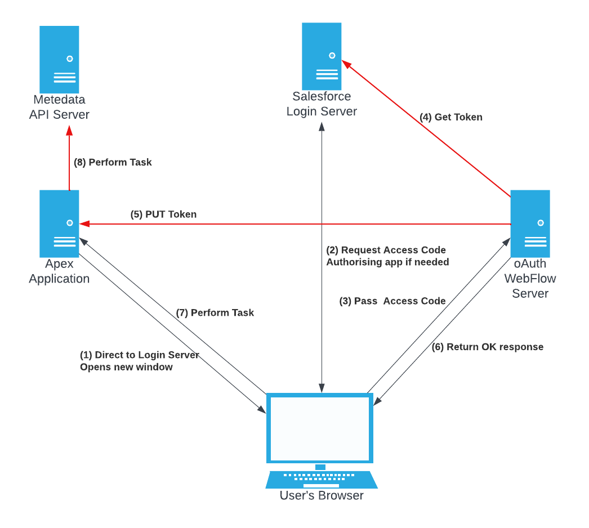

# JWT Web Flow  Sample Code

This project contains sample code to allow Metadata API calls from Apex using the OAuth Web App Flow. The code is derived from the JWT Bearer Flow example, but JWT support has been removed in favour of Web Flow support. This keeps the code simple by removing the need to switch implementations.

The project also demonstrates a possible means of storing a large number of OAuth tokens in an Org. The SObject Token Store runs contrary to accepted best practice for storing secrets in Salesforce.
It is included for purpose of discussion. If the use of a Connected App is limited to administrative users then the Protected Setting Token Store should be adequate. The Protected Custom Setting
Store follows accepted best practice. It is limited by the 10M storage limit for Custom Settings. If non-administrative users need to use this functionality, for example to access Wave, then
that 10M can soon run out. This sample code does not provide a cleanup mechanism for stale token data.

The code consists of an Apex application and sample Lightning page. The sample uses the Connected App to perform a trivial Metadata read operation as a demonstration of capability to access the MDAPI.

_DISCLAIMER_ This code is provided as a sample only. We do not recommend you use this code in any production system, it is provided for demonstration purposes only.

## Branch Notes - Removing client information from Apex code

This branch explores techniques to remove knowledge of OAuth Client IDs and Secrets from Apex.
This allows these values to be rotated more easily.

The first and most simple change is to send the initial request to the web server which redirects to the
init URL. This is adequate if you are not using Refresh Tokens.

The second change is to ask the web server to refresh on our behalf. The initial system accepts the refresh
token and performs the flow again. The result is PUT to Apex as in the initial flow. This prevents a token
being available by GET request so strengthens the system. It also results in the need for a new execution
context to use the token. The sample handles this by retrying from the LWC client.

A planned future change is to strengthen the refresh endpoint, either by requiring authentication to use it
or using a surrogate for the refresh token. The surrogate is validated before the call to Salesforce.

## Context

Applications have traditionally used the Apex method UserInfo.getSessionId() when calling into Salesforce's Metadata API for metadata operations to authenticate. A change to the Salesforce security review process has required that a ConnectedApp is used in some circumstances, see [salesforce.stackexchange.com](https://salesforce.stackexchange.com/questions/389121/call-salesforce-api-from-apex-and-not-fail-security-review) and [Partner Forum](https://partners.salesforce.com/0D54V00006EGIJz) for further details.

This solution is provided as an alternative to the JWT Bearer Flow solutions. It uses OAuth Web Flow which requires a small external web server. The demonstration hosts the web server on the
local machine. The web server posts the token back to the Org for use. This solution is more friendly for the administrator than the JWT solution. The OAuth process is familiar. Web Flow is also
far more open to control through local policies. The administrator can control the lifetime of access and refresh tokens. The system at its most restrictive can disallow refresh tokens completely
and give access tokens only minutes of lifetime. This causes the system to require the user to be present for all interactions. At its least restrictive setting the system can be allowed to run
autonomously at any time.

The demonstration MDAPI call used here is read-only, so it has no org impact. This type of operation does not need a Connected App under the new security guidelines.

## A brief introduction to Tokens

Two types of authentication token are important to this solution.

### Access Token
An Access Token provides access to the protected resource, in this case the Metadata API. The ultimate goal of the solution is to provide an Access Token to code that needs it.
Access Tokens tend to be short lived. This can be configured by the administrator and may be set to as little as fifteen minutes without use.

### Refresh Token
The Refresh Token implements the "Access the system at any time" permission seen when the user accepts the OAuth dialog. These last longer than Access Tokens, maybe 90 days. This
also can be controlled by the administrator and may be set so that the refresh token is never valid.

Refresh tokens are not required if all interactions will take place with the user in front of the computer. In this case every time a controlled action or series of controlled actions 
is performed the browser must go through the web flow process. Refresh tokens are useful if a process is to run later asynchronously. They may also help Subscriber Support who cannot
use web flow to create an access token.

The demo allows refresh tokens to be turned off.

Storing both access and refresh tokens increases storage requirement in the Protected Custom Setting. It is possible, if refresh tokens are known to work, to only store the refresh token
and create a new access token every time. Salesforce does not force rotation of refresh tokens on each use and does not appear to provide a means to. The demo stores access tokens in case
the refresh token is disabled.

## OAuth Web Flow



This is the Web Flow as implemented by the demo. This flow uses a packaged Connected App. Protected Custom Metadata is used to store its client key and web address.
The Client Secret is needed to support Refresh Tokens and can be omitted if refresh
tokens are not needed.

1.  The application opens a new Window on the client browser and directs it to the
    Salesforce Login Server passing the ID of the Connected App
2.  Salesforce takes the user through Web Flow Authorisation.
    This may be shortcut if the user has already authorised the Connected App.
3.  The browser is redirected to the demo web server, passing an Access Code
4.  The demo web server uses the Access Code to request a Token from Salesforce.
5.  The demo web server directly passes the token to the Org using the Org details
    returned by Salesforce. This prevents interception.
6.  The demo web server serves a small web page containing Javascript that sends an
    OK message to the original caller
7.  The client application retries the server call to perform its task
8.  The apex code uses the stored token to access the Metadata API.

## Storing runtime secrets

This solution chooses to pass tokens to the process via the Org rather than through the web flow in order to avoid tokens being present in the browser where they could be intercepted.
It needs to store tokens long enough to be picked up by whatever process is initiated, until that process is finished with them. If refresh tokens are used then they can be stored for
a long time.

The accepted practice for storing runtime secrets is the Protected Custom Setting.
This is the default storage mechanism used in the demo. There could be a use case where the amount of tokens that need
to be stored exceeds the storage capacity of Protected Custom Settings. Then another mechanism would be needed.
Improvements to the Custom Setting Store could see it aggressively cleaning stale tokens but a heavy use system will
need more storage.

### The SObject Large Token Store

The SObject Token Store uses an SObject to store tokens. It needs to protect these from access. One solution could be
to use a Protected SObject. This is a new feature. The solution here encrypts the data in the SObject using an
encryption key that is stored in a Protected Custom Setting. The key is generated randomly on first use, so every org
has its own key.

Mechanisms are in place to prevent data tampering. Each stored token is signed with the Org ID and User ID it belongs to,
so records cannot be swapped in order to allow one person to log in as someone else. The data is padded so that it is
not possible to tell whether or not a record contains a token.

### Custom Metadata

Information about the Connected App is stored in Protected Custom Metadata. The Client ID and redirect URLs are not
secret. They can be learned by monitoring browser requests. The Client Secret does need to be protected. This is only
needed for Refresh Tokens, so can be omitted if refresh tokens are not used. Other solutions can be explored if the
developer does require Refresh Tokens and does not wish to store the Client Secret in their Packaging Org. 
These may or may not require token storage in the Web Server.

The Client Secret does not seem as frightening a secret to keep as a JWT Signing Key. Where the JWT Signing Key would
allow impersonation of any user from anywhere on the Internet, an attacker with the Client Secret also needs to steal a
refresh token or take over the web server. Both of these would be well protected.

## Building the Apex Application

Before building you need to set shell environment variables. These instructions assumed a POSIX or POSIX-like system such as MacOS or Linux.

```
. ./substitutions.sh
sfdx force:source:push
```

The first push will be invalid because you do not know the Client ID and Secret for your Connected App. After first push you need to log into the org, go to `App Manager` and open the `Web Flow Demo` connected app. Manage the Consumer Details and copy the Client ID and Client Secret into the correct parts of `substitutions.sh`. Then recompile.

```
. ./substitutions.sh
sfdx force:source:tracking:clear
sfdx force:source:push -f
```

The `MDAPI_Demo` permission set allows access to the demo page.

## Building the webserver

See the documentation in [the webserver directory](webserver/README.md). Pay special attention to the security notes there.

## Code Structure

The code structure explores some design patterns for larger systems. It is perhaps a little overkill here but offered a chance to explore these ideas.
A central Application class provides common infrastructure on which the rest of the codebase can depend. Its `getApiAccessToken()` method is the tool
that would be used by application code when it needs a token.

The LWC controllers are the entry points. LWC controllers tend to become large facades with methods for every user interaction that a Component or
Page can do. Having one Controller per Component makes managing Permission Sets easier because only one class permission has to be
granted. It also makes it easier to find the code.

The Controller calls Service Classes to perform work. The service classes are domain specific.
The result of this pattern when using compile time linking is an LWC Controller facade that depends on multiple services. The services themselves become
facades when the [Apex Enterprise Patterns](https://trailhead.salesforce.com/content/learn/modules/apex_patterns_sl/apex_patterns_sl_learn_sl_principles)
are used. Each facade brings in a number of dependencies resulting in a large dependency graph and poor performance for the LWC application. Cold starts
are particularly badly affected.


This code demonstrates a form of Command Pattern to encapsulate the Service Layer. The LWC Controller uses reflection to find and invoke
the required service. Reflection has a cost, but we only use it at entry point. The cost is smaller than class-loading the entire dependency tree for
all possible operations that the LWC can perform. The central Application class provides a convenient method to call Commands and to handle errors for
LWC components, so reusing boilerplate code. Commands have been grouped here into tightly related operations in order to encapsulate knowledge.

Care is needed with this pattern to prevent dependencies being introduced accidentally. This leads to Commands that can only take base types as arguments.
The resulting decoupling adds to code maintenance cost due to lack of compiler support for type/parameter checking. This pattern is a trade-off.
